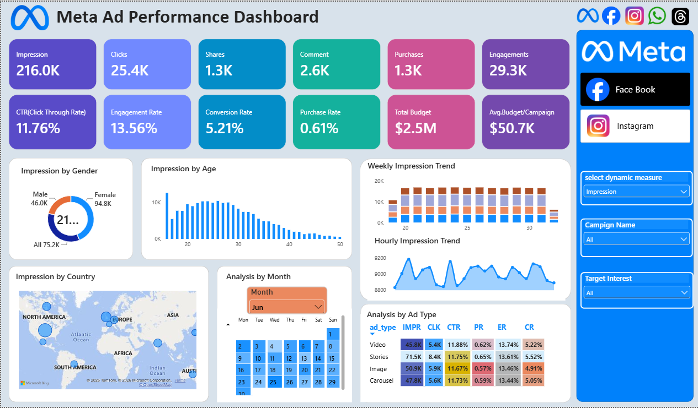

# Meta Ad Performance Dashboard

## 📊 Project Overview

An interactive Power BI dashboard developed to analyze Meta advertising performance across Facebook and Instagram campaigns.

The dashboard provides insights into impressions, clicks, engagement, conversions, purchases, campaign performance, audience demographics, and advertising efficiency.

## 🛠️ Tools & Technologies

- Microsoft Power BI
- Power Query
- DAX
- Data Modeling
- Data Visualization

## 📈 Dashboard Features

- Impressions and clicks analysis
- CTR, engagement rate, and conversion rate
- Purchase and conversion analysis
- Campaign performance analysis
- Facebook and Instagram performance
- Audience analysis by gender and age
- Geographic performance analysis
- Weekly and hourly performance trends
- Ad type performance comparison
- Interactive filters and slicers

## 🔍 Key Analysis

- Overall advertising performance
- Campaign-level performance
- Audience demographic analysis
- Geographic analysis
- Ad type comparison
- Engagement and conversion analysis
- Identification of high-performing campaigns and audiences

## 🖼️ Dashboard Preview

## 📁 Project Files

- `Meta-Ad-Performance-Dashboard.pbix` — Power BI dashboard project file
- `Screenshots/Meta_Ad_Performance_Dashboard.png` — Dashboard preview

## 🎯 Skills Demonstrated

- Power BI Dashboard Development
- Power Query
- DAX
- Data Modeling
- KPI Development
- Data Visualization
- Business Analysis
- Performance Analysis
